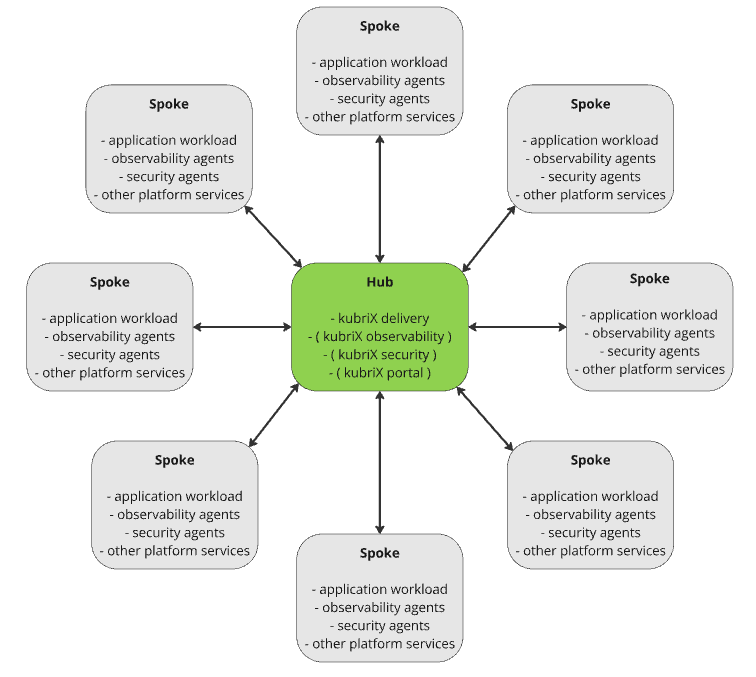
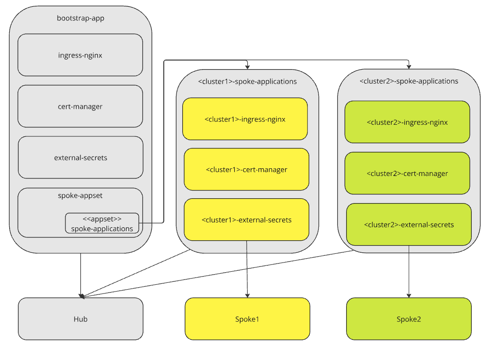

# Hub & Spoke Architecture (kubriX prime Feature)

In Topologies where you want a central management cluster managing many workload clusters
we often speak about so called "Hub and Spoke" topologies.

"Hub" is the central management cluster (or control-plane cluster) and "spokes" are the workload clusters where your custom applications run.



On the central mgmt-cluster the following kubriX components can run:

* kubriX delivery
* kubriX security
* kubriX observability
* kubriX portal

At least "kubriX delivery" is essential on the hub, since it is responsible for deploying all apps on the spokes.
Of course it is totally legit to deploy e.g. kubriX portal and kubriX observability also on a seperate control-plane cluster.
However, for the sake of simplicity, let's assume every kubriX control-plane component is on the same control-plane cluster.

On the spokes are the following components installed (via kubriX delivery on the hub):

* your custom application workload
* some kubriX platform services like cert-manager, ingress-nginx, external-secrets
* kubriX security agents like falco, kyverno, ...
* kubriX observability agents like k8s-monitoring (alloy, ...)

# Deployment of kubriX platform services on the hub

This is the same way as in a single instance topology.
Define your bricks in your values file in the folder "platform-apps/target-chart", bootstrap your platform and let argocd manage your platform apps.

# Deployment of kubriX platform services on the spokes

To set up the spoke deployments you need to do the following steps.

## Add spoke-appset app to your platform

In your "platform-apps/target-chart" values file add the following stanza:

```
  # include app when you want to deploy apps to spoke clusters in a hub-and-spoke architecture
  - name: spoke-appset
    destinationNamespaceOverwrite: argocd
```

The values of this spoke-appset need to define a (cluster) generator for the appset and default valueFiles (see example values files).

With this an ArgoCD ApplicationSet gets deployed which creates an App-Of-Apps for each spoke cluster according to the generator.
This App-Of-Apps gets defined in the spoke-applications chart as follows.

## Define spoke-applications

The values file of "platform-apps/charts/spoke-applications" is very similar to the "platform-apps/target-chart" values file.
You define a list of applications which should get deployed to all spokes. The semantic is the same as in the target-chart.

# Propagating spoke specific values to spoke applications

The values files for each spoke application is defined in `.default.valueFiles` array, which would be the same for every spoke cluster.
Therefore, just with values files there would not be any possibility to set spoke specific values.

To achieve this you should define spoke specific properties as labels in your [cluster secret](https://argo-cd.readthedocs.io/en/stable/operator-manual/declarative-setup/#clusters).

The value of these labels can then be used the `valuesObject` attribute of your spoke application.

## Example

Ingress label in cluster secret:

```
kind: Secret
metadata:
  labels:
    spoke.kubrix.io/ingress-domain: staging.kubrix.cloud
```

spoke-appset values file:

Use this label in your generator attribute and the value in your parameters attribute:

```
generator:
  - clusters:
      selector:
        matchExpressions:
        - key: name
          operator: NotIn
          values:
          - in-cluster
      values:
        ingressDomain: '{{index .metadata.labels "spoke.kubrix.io/ingress-domain"}}'

parameters:
  - name: default.repoURL
    value: '{{ .Values.default.repoURL }}'
  - name: default.targetRevision
    value: '{{ .Values.default.targetRevision }}'
  - name: destinationServer
    value: '{{`{{.server}}`}}'
  - name: destinationClusterName
    value: '{{`{{.name}}`}}'
  - name: ingressDomain
    value: '{{`{{.values.ingressDomain}}`}}'
```

Now the `ingressDomain` value gets propagated to your spoke-applications and can be used here in the applications list `valuesObject`:

```
  - name: falco
    valuesObject:
      falco:
        falcosidekick:
          webui:
            ingress:
              hosts:
                - host: falco.{{ .Values.ingressDomain }}
                  paths:
                    - path: /
                      pathType: Prefix
              tls:
                  - secretName: falco-server-tls
                    hosts:
                      - falco.{{ .Values.ingressDomain }}
    annotations:
      argocd.argoproj.io/compare-options: ServerSideDiff=true
    helmOptions:
      skipCrds: true
    syncOptions:
      - ServerSideApply=true
```

# Overall composition of Apps-Of-Apps and AppSets in Hub & Spoke

In the first place it can be quite confusing how all these pieces work together.
So lets have a look at the overall composition of app-of-apps, appsets and apps and where they get deployed to.



The spoke-appset is part of the bootstrap-app. This spoke-appset creates an ApplicationSet 'spoke-applications'
which creates a spoke-applications App-Of-Apps for each spoke.

While the grey applications get deployed on the Hub, the yellow and green applications get deployed on the corresponding spokes.


