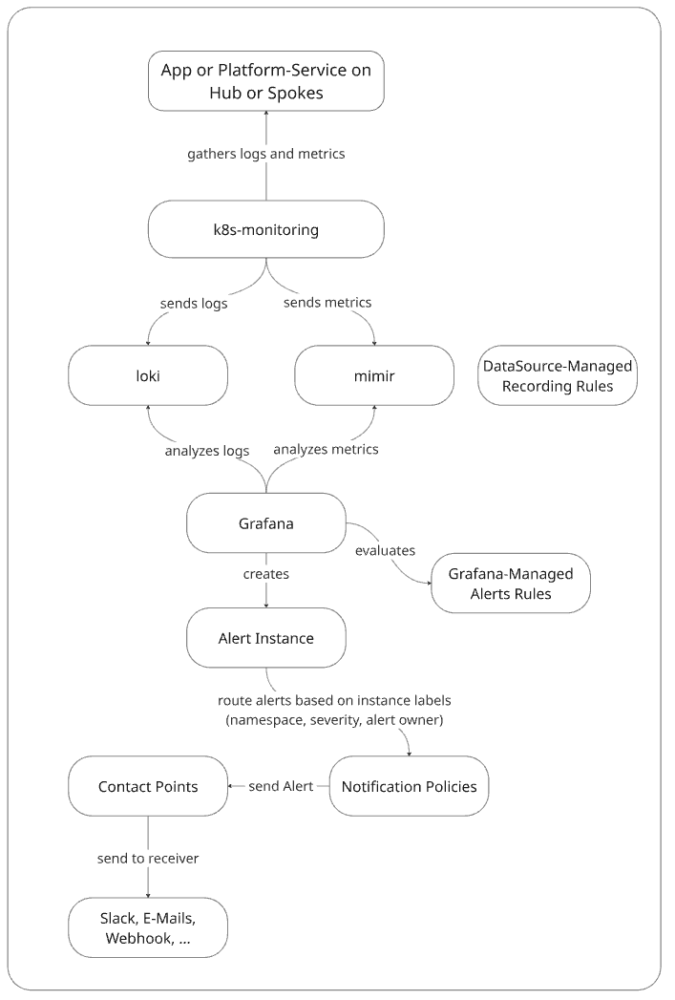

# Alerting

In kubriX we defined some default Kubernetes alert rules as Grafana-managed alert rules in `platform-apps/charts/grafana/alert-files/kubernetes-alerts.yaml` . This alerts apply to all applications and based on the specific namespace where this alert instance comes from the corresponding team gets alerted.

The required mimir-datasource-managed recording rules include some equivalent to [Grafana cloud recording rules](https://grafana.com/docs/grafana-cloud/monitor-infrastructure/kubernetes-monitoring/configuration/manage-configuration/#recording-rules) and the Grafana-Managed Alerting Rules correspong to [Grafana cloud alerting rules](https://grafana.com/docs/grafana-cloud/monitor-infrastructure/kubernetes-monitoring/configuration/manage-configuration/#alerting-rules).

To activate these alert rules you need to enable them in the kubriX grafana values file like this:

```
kubernetesAlerts:
  enabled: true
```

You can extend these alert rules by creating your own ConfigMaps in the `grafana/templates` directory.

The high-level data flow diagram looks like this:



# Platform team contact points

The platform team contact point is the default receiver for alerts. So every alert which doesn't come from application team specific namespaces will get received by the platform team.

You can configure the contact point in the kubriX grafana values file in the `kubernetesAlerts` attribute like this:

```
kubernetesAlerts:
  platformTeamContactPoint:
    receivers:
      - uid: platform-team-default
        type: teams
        settings:
          url: https://myteams-url.com
        disableResolveMessage: false
```

# Application team contact points

The contact point per team are defined in the team-onboarding values with the `alerting` attribute.

Example:

```
  - name: my-awesome-team
    alerting:
      contactPoints:
        receivers:
          - uid: my-awesome-team
            type: teams
            settings:
              url: https://prod-123.westeurope.logic.azure.com:443/workflows/abc123-my-personal-webhook
            disableResolveMessage: false
```

## Vault Integration

If you want some contact point data stored in Vault instead of place in your git repo,
you can create secrets in your `kubrix-kv/<team-name>/observability` path.

Every key in this secret gets extracted in an ExternalSecret and is exposed as an environment variable in Grafana.
To prevent overwriting environment variables from other teams or from Grafana itself, every key gets the prefix "KUBRIX_<team-name>" (all "-" are replace with "_" in the team name).

Example:

Create a key `MSTEAMS_WEBHOOK` in the `kubrix-kv/my-awesome-team/observability` path and as the value your alerting webhook URL:

```
MSTEAMS_WEBHOOK: https://prod-123.westeurope.logic.azure.com:443/workflows/abc123-my-personal-webhook
```

In your team-onboarding values section you can use the variable `KUBRIX_MY_AWESOME_TEAM_MSTEAMS_WEBHOOK` as the webhook url:

```
  - name: my-awesome-team
    alerting:
      contactPoints:
        receivers:
          - uid: my-awesome-team
            type: teams
            settings:
              url: ${KUBRIX_MY_AWESOME_TEAM_MSTEAMS_WEBHOOK}
            disableResolveMessage: false
```

              
