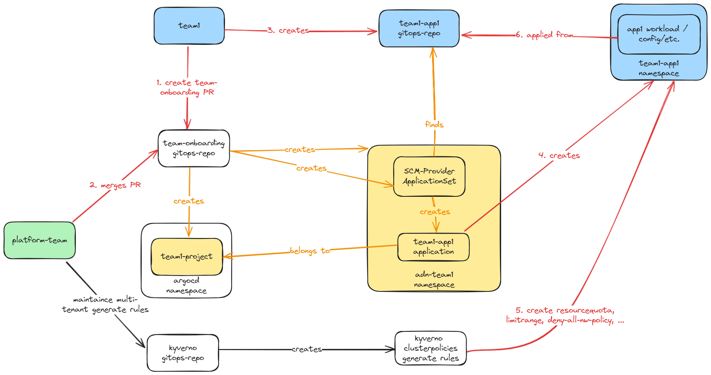
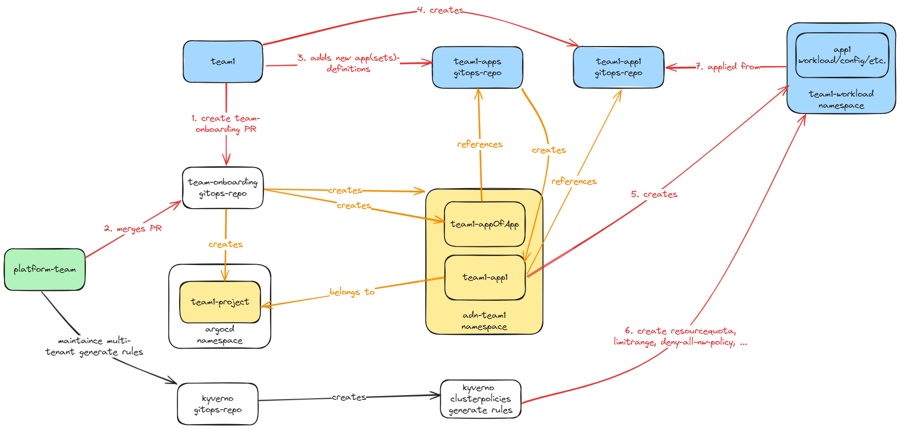

# Onboarding teams and apps

According to the ADR [Onboarding teams in a gitops way](https://github.com/suxess-it/kubriX/blob/main/backstage-resources/adr/0001-gitops-onboarding-teams.md) we are currently working with the approach [apps-in-any-namespace and multi-tenant kyverno-policies](https://github.com/suxess-it/kubriX/blob/main/backstage-resources/adr/0001-gitops-onboarding-teams.md#apps-in-any-namespace-and-multi-tenant-kyverno-policies).

For detailed explanations how this approach works, please read through the ADR.

Here we want to give you a good overview how this approach works and what platform-teams and dev-teams need to do.

## Overview - Onboarding teams and apps with ApplicationSets

While this picture seems to be complex, it actually shows that onboarding teams and apps is just as easy as follows:

1. dev-team creates a PR to the argocd gitops-repo with some team-information
2. platform-team reviewes this PR and merges it
3. dev-team then creates its own app gitops-repo

that is actually everything what people need to do!

The internal operators, controllers and a little bit of love and magic then

4. creates the new namespace for this new app
5. kyverno generate rules create some resources to avoid some noisy neighbors like resourcequotas, limitranges and deny-all-network-policies
6. and all kubernetes resources for this new app get applied in this namespace

## Overview - Onboarding teams and apps with App-Of-Apps

Also this picture is probably a little bit overwhelming in the first place, but in the end there is just one additional step here

1. dev-team creates a PR to the argocd gitops-repo with some team-information
2. platform-team reviewes this PR and merges it
3. dev-team then creates its own app-of-apps gitops-repo <--- this step is added in this scenario
4. dev-team then creates its own app gitops-repo which is referenced in an app-definition in step 3

Then (again) the platform does everything it is build for and 

5. creates the new namespace for this new app
6. kyverno generate rules create some resources to avoid some noisy neighbors like resourcequotas, limitranges and deny-all-network-policies
7. and all kubernetes resources for this new app get applied in this namespace

This approach uses App-Of-Apps instead of ApplicationSets to onboard new apps in a gitops-way.
It is up to you or your dev-teams what they like more. The good thing is, each dev-team can decide for themselves how they want to onboard their apps.

## Details for onboarding new teams

### add new team and configuration in team-onboarding chart

add a new team in this [teams-array](https://github.com/suxess-it/kubriX/blob/d2edfc78fe31109f3b33dcd4071a5247ab4abad1/platform-apps/charts/team-onboarding/values-k3d.yaml#L1-L18) with the corresponding attributes.

#### app-onboarding options
with [appOfAppsRepo](https://github.com/suxess-it/kubriX/blob/d2edfc78fe31109f3b33dcd4071a5247ab4abad1/platform-apps/charts/team-onboarding/values-k3d.yaml#L13-L16) we define a gitops-repo where the dev-team can create its own application definitions. Still, it is automatically restricted that these applications can only belong to the teams argocd app-project.

with [multiStageKargoAppSet](https://github.com/suxess-it/kubriX/blob/d2edfc78fe31109f3b33dcd4071a5247ab4abad1/platform-apps/charts/team-onboarding/values-k3d.yaml#L17-L18) an ApplicationSet is automatically created in the adn-<team> namespace which constantly searches for corresponding gitops-repos and adds new applications automatically in the adn-<team> namespace. This special ApplicationSet creates an application per stage defined in an `app-stages.yaml` like this [example](https://github.com/suxess-it/team1-demo-app1/blob/main/app-stages.yaml) and adds kargo project, warehouse and stages to the cluster.

### check if multi-tenant kyverno-policies get applied

we set them in [kyverno-policies array](https://github.com/suxess-it/kubriX/blob/98f8990c888b60283f3c3f51ac19c505b71e8141/platform-apps/charts/kyverno/values.yaml#L1)

currently there is just a limitrange and resourcequota resource generated, networkpolicies and others will follow.

## Details for onboarding new apps

As a dev-team you then can add new applications in different ways now depending on the knowledge and flexibility of your dev-team.

### one simple deployment-descriptor with appset and base-chart provided by platform-team automatically

tbd .. with an "all-in-one-flexible-helm-chart", an appset with multi-source app and a simple deployment-descriptor like https://github.com/jkleinlercher/just-one-yaml-deployment/blob/main/apps/my-aspnetapp/deployit.yaml you can automatically generate new apps.

### one simple deployment-descriptor for multi-stage app with kargo project

create an app like [team1-demo-app1](https://github.com/suxess-it/team1-demo-app1) with this [app-stages.yaml](https://github.com/suxess-it/team1-demo-app1/blob/main/app-stages.yaml) in it.

The repo organization must match the organization defined in the team-onboarding attribute "teams.[].multiStageKargoAppSet.organization" and the repo-name must start with the team name (e.g. team1-demo-app).

Then apps for each stage in the app-stage.yaml get created, and a corresponding kargo project, warehouse and stages which is responsible for git-promotion to production.

This approach does lots of things out-of-the-box and is good, as long as you are fine with the standards the ApplicationSet and the [Application-Helm-Chart](https://github.com/suxess-it/kubriX/blob/main/team-apps/onboarding-apps-charts/multi-stage-app-with-kargo-pipeline/README.md#applicationset-with-scm-provider) define.

### use some platform helm-chart as a source for an applicationset

the same Application-Helm-Chart as in the option before can also be used directly in an ApplicationSet which the dev-team just creates in ins team-app-of-apps-repo, like https://github.com/suxess-it/team1-apps/blob/main/k3d-apps/example-multi-stage-app-with-kargo.yaml.

describe in
- https://github.com/suxess-it/kubriX/blob/main/backstage-resources/adr/0002-gitops-onboarding-apps.md#applicationset-with-parent-helm-chart
- or in https://github.com/suxess-it/kubriX/blob/main/backstage-resources/adr/0002-gitops-onboarding-apps.md#applicationset-with-configjson-representing-a-parent-helm-chart

### deploy applications as you want

just deploy an argocd app definition and other K8s resources in your [team-app-of-apps-repo](https://github.com/suxess-it/team1-apps/tree/main/k3d-apps) as defined in the team-onboarding attribute "teams.[].appOfAppsRepo".

