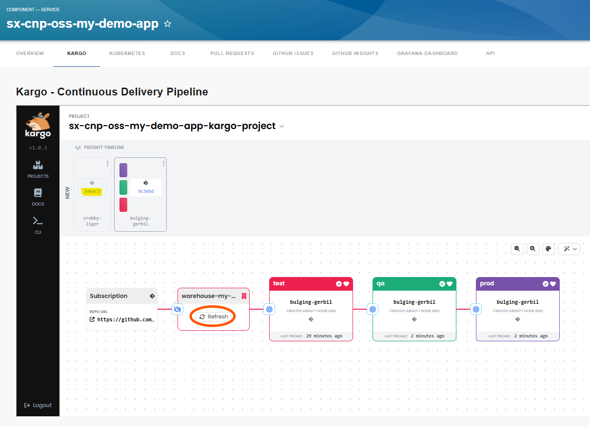
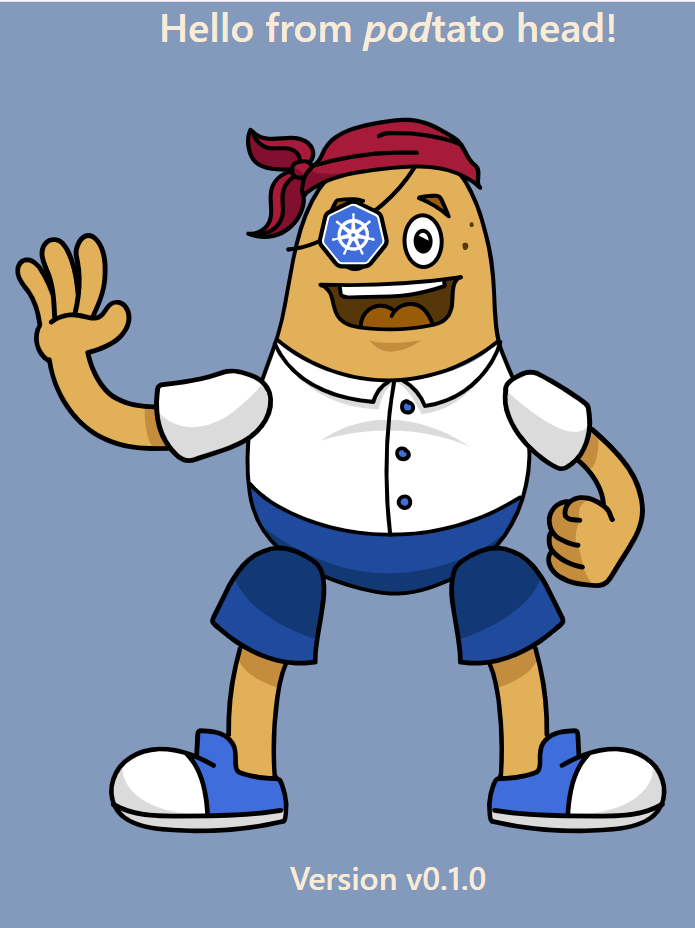

# Promoting changes with Kargo

When you want to make changes to your applications Kubernetes resources you can simply click "View sources" on your components overview page. Use the "umbrella" application and not the stage specific application for this!

In our showcase we change the value in our values.yaml .hat.env[0].value to "03" and commit the change to main Branch,
which will change the podtato heads hat!

In your "Kargo" tab you will see this new commit in the "Freight timeline" automatically or you need to click "Refresh" on your "Warehouse".

When you click on the "Promote" button on the left side of the "test" box and then click on the new "freight" you we see the question
"Are you sure you want to promote test". Answer with "yes".

Then this new commit will get promoted to your "test" branch and the "test" ArgoCD app will get synchronized.

During promotion several quality gates could be implemented to be sure your new version is also working.

In this way you can promote your changes to the production system and you will see that the hat changes to a nice pirate cap.

