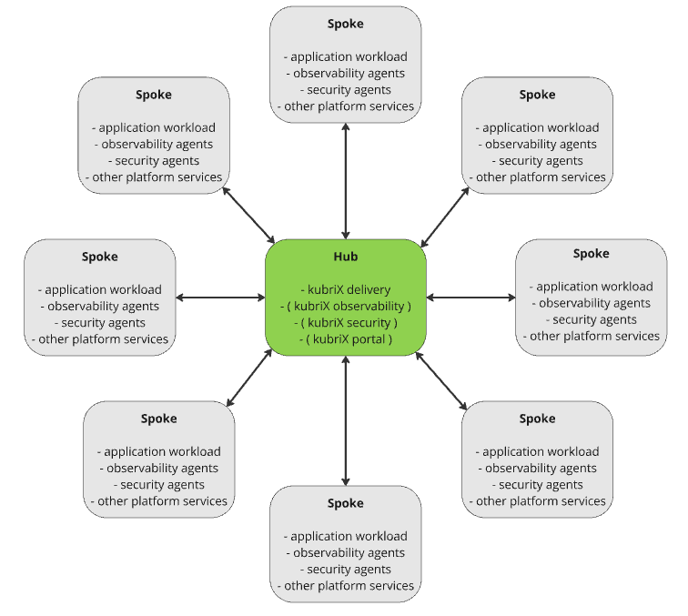
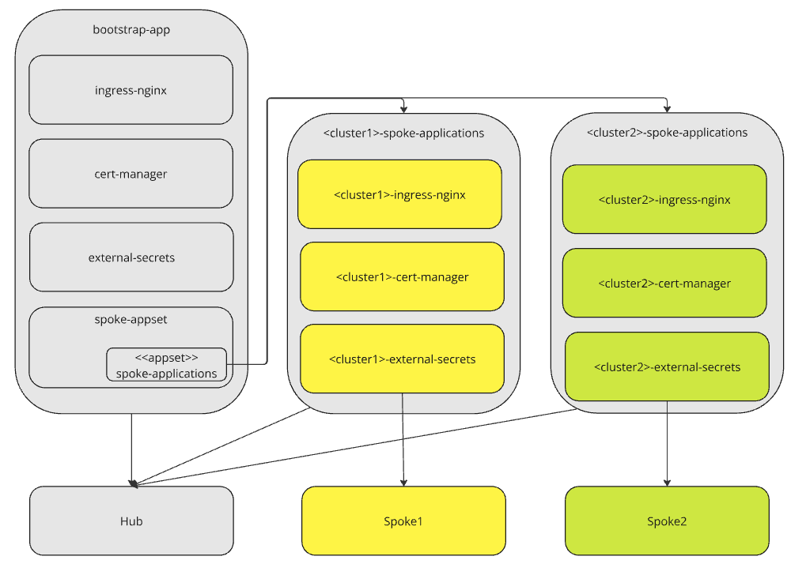

# Hub & Spoke Architecture (kubriX Prime feature)

In topologies where you want a **central management cluster** operating many **workload clusters**, we speak of a _Hub & Spoke_ model.  
The **Hub** is the central management (control-plane) cluster; the **Spokes** are workload clusters where your application workloads run.



---

## What runs where?

### On the Hub (management cluster)
The Hub typically hosts kubriX control-plane components such as:
- **kubriX Delivery** _(required)_ – deploys apps and platform services to Spokes
- **kubriX Security**
- **kubriX Observability**
- **kubriX Portal**

> You **must** run **kubriX Delivery** on the Hub, because it is responsible for orchestrating deployments to the Spokes.  
> Portal and Observability can also be deployed onto a separate control-plane cluster if desired.

### On the Spokes (workload clusters)
Installed **via kubriX Delivery** from the Hub:
- Your **application workloads**
- Selected **kubriX platform services** (e.g., cert-manager, ingress-nginx, external-secrets)
- **kubriX Security agents** (e.g., Falco, Kyverno)
- **kubriX Observability agents** (e.g., k8s-monitoring / Alloy)

For simplicity, examples below assume all kubriX control-plane components run on the same Hub cluster.

---

## Deploying platform services on the Hub

This is the same as a single-cluster topology:
1. Define your bricks in the values file of `platform-apps/target-chart`.
2. Bootstrap the platform.
3. Let Argo CD reconcile your platform apps.

---

## Deploying platform services to the Spokes

### 1) Enable the `spoke-appset` on the Hub
In your `platform-apps/target-chart` **values** file, include the `spoke-appset` app. This creates an **ApplicationSet** that will generate a per-spoke **App-of-Apps**:

```yaml
# Include this app when you want to deploy apps to Spoke clusters
# in a Hub & Spoke architecture.
- name: spoke-appset
  destinationNamespaceOverwrite: argocd
```

The `spoke-appset` values must define a Cluster generator and default `valueFiles`.
The Cluster generator uses the set of registered clusters in Argo CD.

### 2) Define spoke-applications

The chart `platform-apps/charts/spoke-applications` defines the **per-spoke App-of-Apps**.
Its values are similar to `platform-apps/target-chart`: you list the applications that should be deployed to **all Spokes** (same semantics as in the target-chart).

---

## Propagating Spoke-specific values into applications

The `default.valueFiles` for Spoke applications are shared across Spokes. To inject **cluster-specific values** (e.g., an ingress domain), add **labels** to each Spoke’s **Argo CD Cluster Secret** and expose those labels to your ApplicationSet template via the Cluster generator.
*	Argo CD stores managed clusters in **Secrets** labeled `argocd.argoproj.io/secret-type: cluster`.
*	The **Cluster generator** reads data/labels from those Secrets and provides them as parameters for substitution in ApplicationSet templates.

### Example: Ingress domain per Spoke

**Cluster Secret** (label the Secret with the per-spoke domain):

```yaml
apiVersion: v1
kind: Secret
metadata:
  name: cluster-<spoke-name>
  namespace: argocd
  labels:
    argocd.argoproj.io/secret-type: cluster
    spoke.kubrix.io/ingress-domain: staging.kubrix.cloud
type: Opaque
data:
  # ... cluster connection fields omitted for brevity ...
```

**spoke-appset values** – read the label via the Cluster generator and pass it as a parameter:

```yaml
generator:
  - clusters:
      selector:
        matchExpressions:
          - key: name
            operator: NotIn
            values:
              - in-cluster
      values:
        ingressDomain: '{{ index .metadata.labels "spoke.kubrix.io/ingress-domain" }}'
parameters:
  - name: default.repoURL
    value: '{{ .Values.default.repoURL }}'
  - name: default.targetRevision
    value: '{{ .Values.default.targetRevision }}'
  - name: destinationServer
    value: '{{`{{ .server }}`}}'
  - name: destinationClusterName
    value: '{{`{{ .name }}`}}'
  - name: ingressDomain
    value: '{{`{{ .values.ingressDomain }}`}}'
```

> The Cluster generator provides .server and .name, and you can reference any labels via index .metadata.labels. These are substituted into the template at render time.  

**spoke-applications values** – use the propagated parameter in `valuesObject` for each application:

```yaml
applications:
  - name: falco
    valuesObject:
      falco:
        falcosidekick:
          webui:
            ingress:
              hosts:
                - host: 'falco.{{ .Values.ingressDomain }}'
                  paths:
                    - path: /
                      pathType: Prefix
              tls:
                - secretName: falco-server-tls
                  hosts:
                    - 'falco.{{ .Values.ingressDomain }}'
    annotations:
      argocd.argoproj.io/compare-options: ServerSideDiff=true
    helmOptions:
      skipCrds: true
    syncOptions:
      - ServerSideApply=true
```
---

## How the pieces fit together

* The spoke-appset is part of the bootstrap app on the Hub.
* It creates an ApplicationSet (spoke-applications) which, for each Spoke cluster, generates a per-spoke App-of-Apps.
*	Grey apps are deployed on the Hub; yellow/green apps are deployed on the corresponding Spokes.




