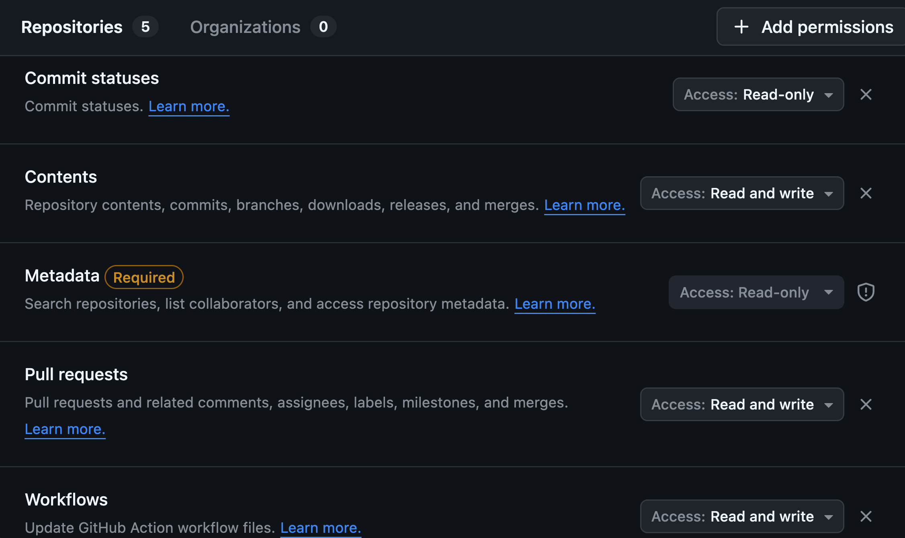

# Quickstart kubriX on a local KinD cluster

With this step-by-step guide kubriX with its default stack gets deployed on your local KinD cluster.

## Prerequisites

* check [Prerequisites](installation.md#-prerequisites)

## Installation steps

1. create new empty customer repo on your Git-Server (GitLab, GitHub, Gitea, ...).
    We fully tested this with GitHub, but others should also work.

    IMPORTANT: the repo needs to be empty (also no initial README!!!)

2. create an access token for this new repo with write access
    
    Instead of a newly created access token you can also use your personal access tokens,
    but this is not recommended since your personal access token has probably more permissions than needed.

    

3. create a new KinD cluster. You need to enable ingress on your KinD cluster so this command below should be used:
        
     ```
     kind create cluster --name kubrix-local-demo --config /dev/stdin <<EOF
     kind: Cluster
     apiVersion: kind.x-k8s.io/v1alpha4
     nodes:
     - role: control-plane
       kubeadmConfigPatches:
       - |
         kind: InitConfiguration
         nodeRegistration:
           kubeletExtraArgs:
             node-labels: "ingress-ready=true"
       extraPortMappings:
       - containerPort: 80
         hostPort: 80
         protocol: TCP
       - containerPort: 443
         hostPort: 443
         protocol: TCP
     EOF
     ```

    Then be sure that kubectl is connected to it. check with `kubectl cluster-info`

4. Create a `kubrix-install` Namespace and a Secret `kubrix-installer-secrets` to configure the installer.  
    The values of `KUBRIX_REPO` and `KUBRIX_REPO_PASSWORD` need to be set to your newly created empty Git repo in step 1 and the access token you created in step 2.

    ```
    export KUBRIX_REPO="https://github.com/kubriX-demo/kubriX-demo-customerXY"
    export KUBRIX_REPO_PASSWORD="your-read-write-access-token"
    export KUBRIX_GIT_USER_NAME="your-github-username"
    
    kubectl create ns kubrix-install
    kubectl create secret generic kubrix-install-secrets -n kubrix-install \
      --from-literal KUBRIX_REPO=${KUBRIX_REPO} \
      --from-literal KUBRIX_REPO_PASSWORD=${KUBRIX_REPO_PASSWORD} \
      --from-literal KUBRIX_GIT_USER_NAME=${KUBRIX_GIT_USER_NAME} \
      --from-literal KUBRIX_DOMAIN="127-0-0-1.nip.io" \
      --from-literal KUBRIX_DNS_PROVIDER="none" \
      --from-literal KUBRIX_TARGET_TYPE="kubrix-oss-stack" \
      --from-literal KUBRIX_CLUSTER_TYPE="kind" \
      --from-literal KUBRIX_BOOTSTRAP=true \
      --from-literal KUBRIX_INSTALLER=true
    ```

6. Then apply the installer manifests:

    ```
    kubectl apply -f https://raw.githubusercontent.com/suxess-it/kubriX/refs/heads/main/install-manifests.yaml
    ```

    These manifests will create a Kubernetes Job which creates a clone of the upstream kubriX OSS repo with some customizations in your newly created repo
    and starts the installation on your local KinD cluster.

    This could take up to 30 minutes, depending how powerful your local environment is.

    You can watch the logs of the job with
    ```
    kubectl logs -n kubrix-install -f "pod/$(kubectl get pod -n kubrix-install -l "job-name=kubrix-install-job" -o jsonpath='{.items[0].metadata.name}')" --all-containers=true
    ```
    
    Especially Keycloak could take a while,
    since there are many resources created via Crossplane in different ArgoCD sync-waves.  
    After 300 seconds the sync process gets terminated and restarted. This could happend sometimes and is not always indicating a problem.
    Also, sometimes the Keycloak app could be in temporary `Degraded` state during installation, but gets `Healthy` afterwards.

##  Next steps

* [Post-Installation steps](installation.md#-post-installation-steps)

