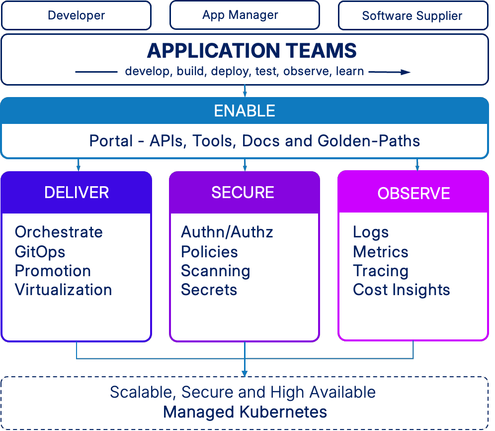

# Overview

## What is kubriX?

kubriX is an **Internal Developer Platform (IDP)** designed to streamline application delivery and platform operations on Kubernetes.  
It provides a **curated yet flexible** set of building blocks (“bricks”) that integrate proven open-source tools into a cohesive, production-ready developer experience.

kubriX enables organizations to:
- Accelerate development cycles
- Standardize deployment workflows
- Improve collaboration between software supplier, developers, platform teams and security engineers
- Operate Kubernetes platforms with confidence

---

## Key Features

- **Easy to use, yet powerful** – The application-centric platform portal puts all your apps, environments, and tools right at your fingertips.
- **Cloud-Agnostic Deployment** – Works with any CNCF-compliant Kubernetes distribution: metalstack.cloud, AWS, Azure, Google Cloud, or on-prem.
- **Zero-Configuration Setup** – Get started instantly with minimal manual steps.
- **Modular “Bricks” Architecture & Auto-Bootstrapping** – Select only the components you need; kubriX bootstraps them into a working platform automatically.
- **Best-in-Class OSS Stack** – Integrates leading open-source tools such as Argo CD, Backstage, Vault, and Grafana—pre-configured and maintained by kubriX.
- **Kubernetes Virtualization & Multi-Tenancy** – Self-service virtual machines and isolated environments out of the box.
- **Developer Self-Service** – Onboard teams and deploy applications via GitOps templates with traceable approvals and no ticketing overhead.
- **Security & Compliance** – Role-based access control, policy enforcement, secrets management, and audit logging built in.
- **Cost Visibility & Management** – Monitor and optimize resource usage to control spend.

---
## When to use kubriX

kubriX is a good fit if you:
- Operate Kubernetes for multiple teams or applications
- Want to provide developers with self-service capabilities
- Need a consistent platform setup across environments (dev, staging, prod)
- Prefer open-source solutions over proprietary lock-in
- Need a self-service platform but don't have the budget or ressources to build it yourself
---

## Architecture at a Glance

At its core, kubriX orchestrates a set of Kubernetes-native services, such as:
- ArgoCD (GitOps-Engine)
- Kargo (GitOps-Promotion)
- Ingress NGINX (Ingress controller)
- Keycloak (IAM)
- Vault and ESO (Secrets Management)
- Kyverno (Policy Management)
- Grafana LGTM (Observability)
- KubeCost (Cost Management)
- ... and many more

All components are pre-integrated but can be replaced or extended as needed.

---

## kubriX Editions

| Edition   | Description | Use Case |
|-----------|-------------|----------|
| **kubriX Free** | Free and open, core functionality for building an IDP | Start small, customize freely |
| **kubriX Prime** | Enterprise-grade edition with advanced features | Production-scale deployments, compliance needs |
| **kubriX Select** | Prime + add-ons on demand | special customized environment with special integration requirements |

For a full feature comparison, see [Open Source vs. Prime](https://kubrix.io/plans).

---

## How to Get Started

1.  [**Install locally**](installation/kind.md) using KinD for exploration  
2. [**Deploy in an empty test cluster**](installation/quick-start-kubernetes.md) with your own kubriX GitOps repo  
3. [**Integrate with your existing Kubernetes setup**](installation/installation.md) for real workloads

---

## Documentation Structure

- **Overview** – What kubriX is and when to use it
- **Installation** – Step-by-step setup instructions
- **Configuration** – How to customize kubriX for your needs
- **User Guide** – How developers work with kubriX
- **Administration Guide** – How to operate, monitor, and maintain kubriX
- **API & CLI Reference** – Commands and endpoints
- **Troubleshooting** – Common issues and solutions

---

## Community & Support

- Join the conversation in our [Slack channel](https://join.slack.com/t/kubrix-platform/shared_invite/zt-2rc1yty2f-VTT3GOzUvo_k5hrgKbppKQ)
- Report issues or request features on [GitHub Issues](https://github.com/suxess-it/kubriX/issues)
- Follow updates on the [kubriX blog](https://kubrix.io/blog)

---

kubriX — **deliver software faster, with ease**
